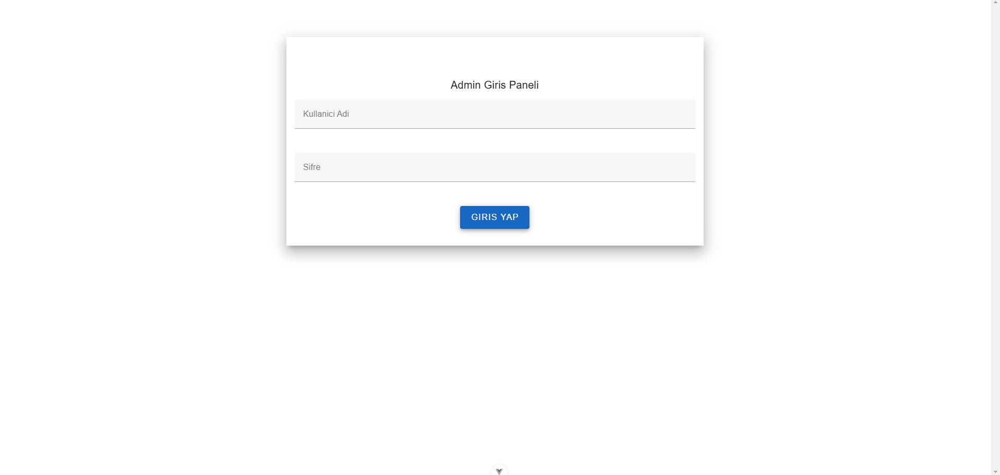
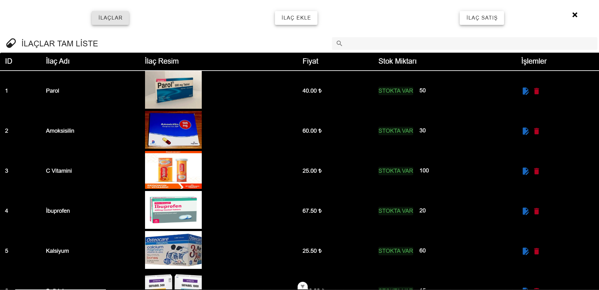
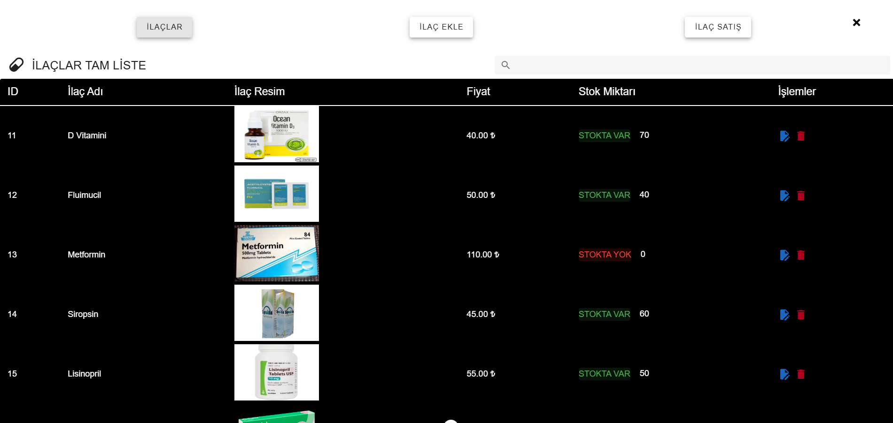
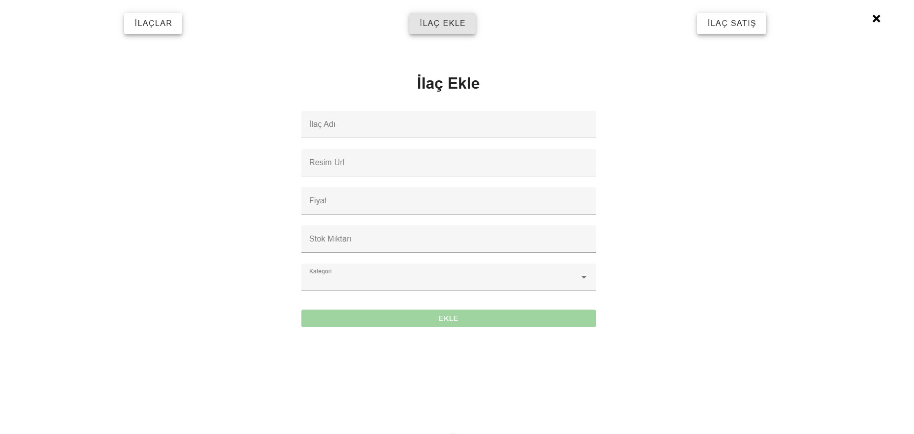
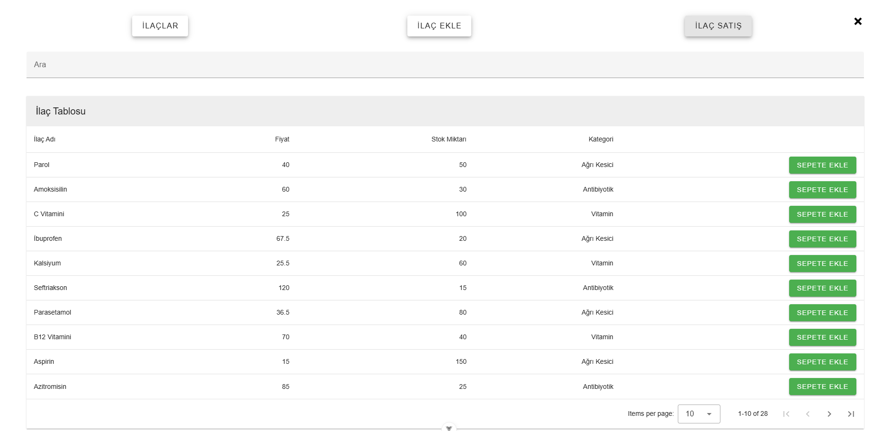
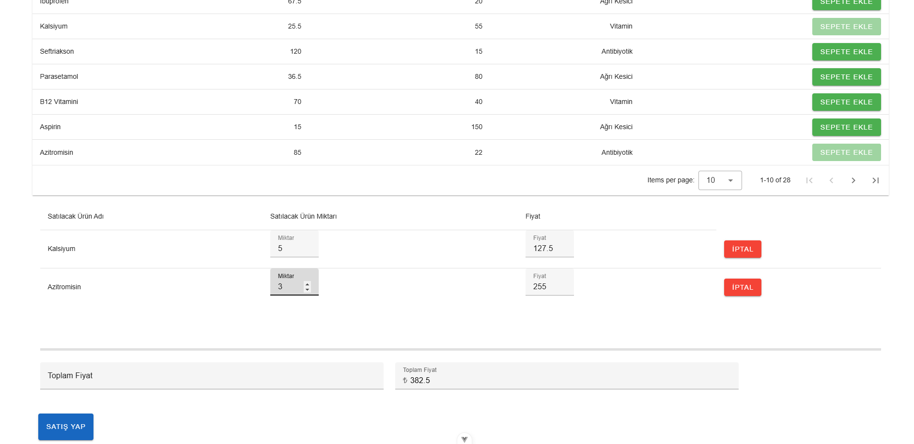

# Eczane Otomasyonu

Bu proje, bir eczane otomasyon sistemi olup Vue.js kullanılarak geliştirilmiştir. Projede, Vuetify kullanılarak modern bir kullanıcı arayüzü sağlanmıştır. Amaç, ilaç stok takibi ve satış işlemlerini kolaylaştırmaktır.

 ## ✔️ Özellikler

 ☑ Kullanıcı Girişi: Kullanıcı adı ve şifre ile giriş yapılır.

 ☑ İlaç Görüntüleme: Vuetify DataTables veya benzeri bileşenler kullanılarak ilaçların listesi görüntülenebilir.

 ☑ Satış İşlemleri: Satış gerçekleştirildiğinde ilgili ilacın stoğu otomatik olarak güncellenir.

 ☑ Stok Yönetimi: İlaç verileri yerel bir veri tabanında saklanır.

 ☑ Vuetify Entegrasyonu: Şık ve kullanışlı bir kullanıcı arayüzü sunar.

 ☑ Options API: Vue.js Options API kullanılarak geliştirilmiştir.

## ⚙️ Kullanım

1. Uygulamayı başlattıktan sonra giriş sayfası görünecektir. Kullanıcı adı ve şifre bilgilerini girerek giriş yapabilirsiniz.  Kullanıcı Adı: admin | Sifre: admin123

2. Giriş yaptıktan sonra ilaçların listelendiği ana ekrana yönlendirilirsiniz.

3. Satış sayfasında bir ilaç seçerek satış işlemini gerçekleştirebilir ve stoğun otomatik olarak güncellenmesini sağlayabilirsiniz.

## 🔧 Teknolojiler

☑ Vue.js: Ana framework

☑ Vuetify: UI bileşen kütüphanesi

☑ HTML5, CSS3, JavaScript: Ön yüz geliştirme

☑ Local Data Storage: İlaç verilerinin saklanması

## 📊 Katkıda Bulunma

Katkılar memnuniyetle kabul edilir! Lütfen bir konu açın veya pull request gönderin.

## 📸 Uygulama İçi Görseller

### ☑ Giriş Sayfası

### ☑ İlaç Listesi

### ☑ İlaç Ekleme

### ☑ Satış Sayfası

